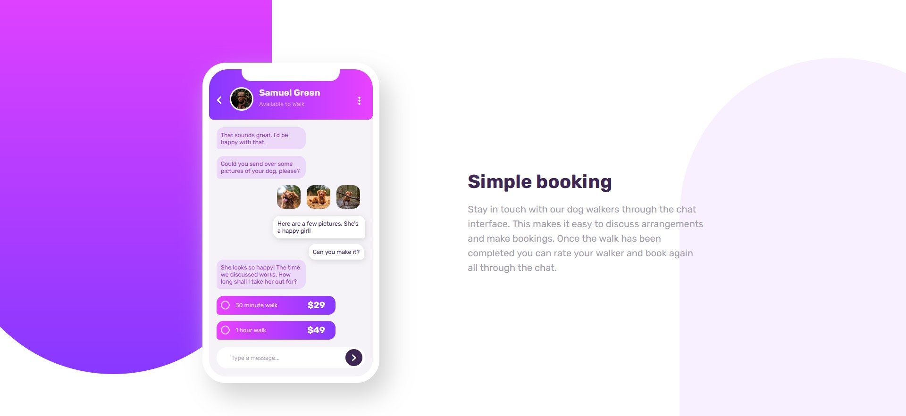

# Frontend Mentor - Chat app CSS illustration solution

This is a solution to the [Chat app CSS illustration challenge on Frontend Mentor](https://www.frontendmentor.io/challenges/chat-app-css-illustration-O5auMkFqY). Frontend Mentor challenges help you improve your coding skills by building realistic projects.

## Table of contents

- [Overview](#overview)
  - [The challenge](#the-challenge)
  - [Screenshot](#screenshot)
  - [Links](#links)
  - [Built with](#built-with)
  - [What I learned](#what-i-learned)
  - [Continued Development](#continued-development)
  - [Useful resources](#useful-resources)
- [Author](#author)

## Overview

### The challenge

Users should be able to:

- View the optimal layout for the component depending on their device's screen size
- **Bonus**: See the chat interface animate on the initial load

### Screenshot

### Links

- Solution URL: [Add solution URL here](https://your-solution-url.com)
- Live Site URL: [Add live site URL here](https://your-live-site-url.com)

### Built with

- Semantic HTML5 markup
- CSS custom properties
- Flexbox

### What I learned

I learned a lot about positioning elements and pseudo classes/elements.

### Continued development

In the future I will try to learn much more in CSS so I can work on more complexive projects on Frontend Mentor.

### Useful resources

- [Top Tal](https://www.toptal.com/designers/htmlarrows/) - This site helped me a lot with CSS codes for elements like arrow and three dots.

## Author

- Frontend Mentor - [@dusanlukic404](https://www.frontendmentor.io/profile/dusanlukic404)
- LinkedIn - [@dusan-lukic](https://www.linkedin.com/in/dusan-lukic)
